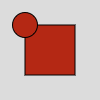
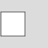
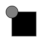
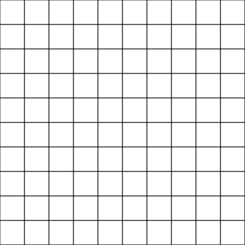

# p5 \<marker>

A [p5.js](https://p5js.org) wrapper for sketching declaratively in XML.

Featuring collision detection using the [p5.collide2D](https://github.com/bmoren/p5.collide2D) library by [Ben Moren](https://github.com/bmoren).

## Contents

- [Motivation](#motivation)
- [Core Concepts](#core-concepts)
  - [Elements](#elements)
  - [Properties](#properties)
  - [Methods](#methods)
- [Logic](#logic)
  - [Conditions](#conditions)
  - [Branching](#branching)
  - [Iteration](#iteration)
- [Getting Started](#getting-started)
- [Reference (under construction)](https://p5-marker-docs.glitch.me)

## Motivation

As a creative coding instructor, I have noticed a few things that beginners often find counterintuitive.

Take this example:


To produce it in p5.js, I need to break that down into a series of steps to produce it:

```javascript
let squareAngle = 0;

function setup() {
  createCanvas(400, 400);
  angleMode(DEGREES);
  noStroke();
}

function draw() {
  background(20);
  push();
  translate(width / 2, height / 2);
  rotate(squareAngle);
  fill(180, 40, 20);
  rectMode(CENTER);
  square(0, 0, 200);
  describeElement(
    "square",
    "Large red square rotating in the center of the canvas."
  );
  squareAngle = squareAngle + 1;
  pop();
  fill(20, 60, 180);
  circle(width / 2, height * 0.75, 100);
  describeElement(
    "circle",
    "Small blue circle in front of the square toward the bottom."
  );
}
```

Given the simplicity of the resulting image, I think there are a surprising number of concepts that need to be introduced in order to produce it. Without careful code organization, I think it's quite easy to lose track of which styling and transformations will affect which things on the canvas.

Here's how to produce that same example in Marker:

```xml
<canvas
    width="400"
    height="400"
    angle_mode="DEGREES"
    background="20"
    stroke="NONE">

    <square
        anchor="width / 2, height / 2"
        size="200"
        rect_mode="CENTER"
        fill="180, 40, 20"
        angle="0"
    >Large red square rotating in the center of the canvas.<_
            parent.angle="angle + 1" />
    </square>

    <circle
        x="width / 2"
        y="height * 0.75"
        diameter="100"
        fill="20, 60, 180"
    >Small blue circle in front of the square toward the bottom.</circle>
</canvas>
```

Styling and transformation properties are directly associated with the visual elements they affect. The elements' inner text generates screen reader accessible descriptions.

Marker offers a way to harness the creative possibilities of programming while focusing on what the creator wants to see, rather than the steps to produce it.

## Core concepts

### Elements

Elements are Marker's building blocks.

The canvas and everything that appears on it are represented by elements.

When you want to change settings without rendering anything, you can use the blank `<_>` element.

Examples:

- \<square>
- \<text>
- \<image>

### Properties

Properties change the way an element is rendered.

For example, \<square> has x, y, and size properties, which adjust its horizontal position, vertical position, and size respectively.

```xml
<square x="25" y="25" size="50" />
```


Property values are passed down to an element's children.

```xml
<square x="25" y="100" size="50">
  <circle diameter="25" />
</square>
```


An element can reference property values passed down its parent. Elements cannot reference their own properties.

```xml
<square x="25" y="25" size="50">
  <circle x="x + 50" diameter="25" />
</square>
```


Properties can be set to multiple values, separated by commas.

```xml
<square x="25" y="25" size="50" fill="180, 40, 20">
  <circle diameter="25" />
</square>
```



An element can change the properties of elements above it on the XML document. This change will override the target element's initially set property value. This can be used for animation.

```xml
<square x="0" y="25" size="50">
  <_ parent.x="x + 1" />
</square>
```



Property names are written in snake case, which looks_like_this: all lowercase with words separated by underscores.

### Methods

Methods are called within property values to calculate a value.

p5.js methods that return a value, rather than render something to the canvas, have a snake case alias.

```xml
<canvas width="100" height="100" background="255">
    <square x="25" y="25" size="50" fill="0">
        <circle
          diameter="25"
          fill="lerp_color(fill, canvas.background, 0.5)" />
    </square>
</canvas>
```



## Logic

### Operators

Because pointy brackets (< >) and ampersands (&) may not be used in an XML attribute value, Marker uses the following
phrases in place of comparison operators:

| phrase       | replaces |
| ------------ | -------- |
| less than    | <        |
| no more than | <=       |
| at least     | >=       |
| greater than | >        |

These may optionally be preceded with "is" as in "x is less than width."

Marker uses the following as logical operators:

| keyword   | replaces |
| --------- | -------- |
| and       | &&       |
| or        | \|\|     |
| not/until | !        |

"is" on its own acts as a strict equality operator.

| keyword | replaces |
| ------- | -------- |
| is      | ===      |

### Branching

The "on" property is evaluated before any other properties. If and only if its value is true, the element's other properties will be evaluated, the element will be rendered, and the element's children will be evaluated and rendered.

The above_siblings_off property is true if the siblings directly above the element either have "on" set to false or do not have an "on" property. This may be used to switch between sibling elements based on conditions, similar to if/else.

```xml
  <circle
    fill=";red;"
    on="frame_count less than 60"
  />
  <circle
    fill=";yellow;"
    on="above_siblings_off and frame_count is less than 120"
  />
  <circle
    fill=";green;"
    on="above_siblings_off"
  />
```

### Iteration

Elements and their children can be iterated using two properties in combination: "repeat" and "change".

Repeat's value is a boolean evaluated with each iteration. If the value is true, the element and its
children will be iterated again. The keyword `until` is the equivalent of
wrapping the proceeding condition with !().

Change's value is an object literal. Each property key is the name of a property, and the corresponding
value represents what that property will be set to with each iteration. The curly brackets may be omitted
in the change properties value (e.g. change="x: x + 1").

```xml
<_
    x="0"
    y="0"
    width="canvas.width / 10"
    height="canvas.height / 10"
    change="x: x + w"
    repeat="until x is at least canvas.width">
    <rect
      change="y: y + h"
      repeat="until y is at least canvas.height" />
</_>
```



## Getting Started

### p5 Editor

Sign in to the [p5 editor](https://editor.p5js.org). Open the [empty example](https://editor.p5js.org/p5-marker/sketches/NyMiMkbAH), and click File > Duplicate.
