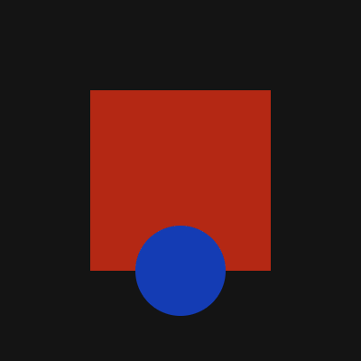
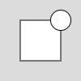

# p5 \<marker>

A [p5.js](https://p5js.org) wrapper for sketching declaratively in XML.

Featuring collision detection using the [p5.collide2D](https://github.com/bmoren/p5.collide2D) library by [Ben Moren](https://github.com/bmoren).

## Contents

- [Motivation](#motivation)
- [Syntax](#syntax)
- [Core Concepts](#core-concepts)
  - [Elements](#elements)
  - [Attributes](#attributes)
  - [Functions](#functions)
- [Logic](#logic)
  - [Conditions](#conditions)
  - [Branching](#branching)
  - [Iteration](#iteration)
- [Getting Started](#getting-started)
- [Reference (under construction)](https://p5-marker-docs.glitch.me)

## Motivation

As a creative coding instructor, I have noticed a few things that beginners often find counterintuitive.

Take this example:



In English, I might describe this as "a large rotating red square with a small blue circle in front of it."

To produce it in p5.js, I need to break that down into a series of steps to produce it:

```
let squareAngle = 0;

function setup() {
  createCanvas(400, 400);
  angleMode(DEGREES);
  noStroke();
}

function draw() {
  background(20);
  push();
  translate(width / 2, height/2);
  rotate(squareAngle);
  fill(180, 40, 20);
  rectMode(CENTER);
  square(0, 0, 200);
  squareAngle = squareAngle + 1;
  pop();
  fill(20, 60, 180);
  circle(width / 2, height * 0.75, 100);
}
```

Given the simplicity of the resulting image, I think there are a surprising number of concepts that need to be introduced in order to produce it. Without intentional code organization, I think it's quite easy to lose track of which styling/transformations will affect which things on the canvas.

Here's how to produce that same example in Marker:

```
<canvas
    width="400"
    height="400"
    angle_mode="DEGREES"
    background="20"
    stroke="NONE"
>
    <square
        anchor="width / 2, height / 2"
        size="200"
        rect_mode="CENTER"
        fill="180, 40, 20"
        angle="0"
    >
        <_ parent_element.angle="parent_element.angle + 1" />
    </square>
    <circle x="width / 2" y="height * 0.75" d="100" fill="20, 60, 180" />
</canvas>
```

My goal is to provide a way to create sketches based on what you want to see, rather than how to produce it. Marker uses XML for its declarative syntax.

For folks who want a foundation to build towards more complex imperative programming languages, the implementations of Processing in [Java](https://processing.org/), [JavaScript](https://p5js.org/), and [Python](https://py.processing.org/) work fabulously.

My target audience for Marker are folks focused on creative work, rather than learning programming concepts.

## Syntax

Attribute values are evaluated as JavaScript, so JS syntax applies.

All names are written in snake case, which looks_like_this: all lowercase with words separated by underscores. This is because DOM attributes are case insensitive.

## Core concepts

### Elements

The canvas and everything that appears on it are represented by elements.

The general rule is that p5.js methods that render something to the canvas have a corresponding element.

For situations in which it's helpful to have an invisible element, you can use the blank <\_> element.

Examples:

- \<square>
- \<text>
- \<image>

### Attributes

Style settings, transformations, parameters, and variables are all represented by attributes.

The general rule is that the required parameters for a p5.js method are required attributes on its corresponding Marker element.

For example, the square() p5.js method requires x, y, and s parameters, so the \<square> Marker elements, requires attributes with those same names:

```
<square x="100" y="100" s="50" />
```

Attributes are passed down to an element's children.

```
<square x="100" y="100" s="50">
  <circle d="25" />
</square>
```


You can reference attributes from parents (grandparents, etc.).

```
<square x="25" y="25" s="50">
  <circle x="x + 50" d="25" />
</square>
```



Attributes can be set to multiple values, separated by commas.

```
<square x="25" y="25" s="50" fill="180, 40, 20">
  <circle d="25" />
</square>
<circle x="75" y="25" d="50" />
```


### Functions

Functions are called within attribute values to calculate a value.

p5.js functions that return a value, rather than render something to the canvas, have a snake case alias.

```
<canvas width="100" height="100" background="255">
    <square x="25" y="25" s="50" fill="0">
        <circle d="25" fill="lerp_color(fill, canvas.background, 0.5)" />
    </square>
</canvas>
```


## Logic

### Conditions

Because pointy brackets (< >) and ampersands (&) may not be used in an XML attribute's value, Marker uses the following
escape sequences instead:
|escape sequence|replaces
|--|--
|LESS_THAN|<
|NO_MORE_THAN|<=
|AT_LEAST|>=
|GREATER_THAN|>
|AND|&&
|OR|\|\|

### Branching

The "on" attribute is evaluated before any other attributes. If and only if its value is true, the element's other attributes will be evaluated, the element will be rendered, and the element's children will be evaluated and rendered.

The above_siblings_off property is true if the siblings directly above the element either have "on" set to false or do not have an "on" attribute. This may be used to switch between sibling elements based on conditions, similar to if/else.

```
  <circle
    fill="'red'"
    x="0"
    y="0"
    d="width"
    on="frame_count LESS_THAN 60"
  ></circle>
  <circle
    fill="'yellow'"
    x="0"
    y="0"
    d="width"
    on="above_siblings_off AND frame_count LESS_THAN 120"
  ></circle>
  <circle
    fill="'green'"
    x="0"
    y="0"
    d="width"
    on="above_siblings_off"
  ></circle>
```

### Iteration

Elements and their children can be iterated using two attributes in combination: "repeat" and "change".

Repeat's value is a boolean evaluated with each iteration. If the value is true, the element and its
children will be iterated again. The WHILE and UNTIL escapes can be used to improve legibility
(e.g. repeat="WHILE x LESS_THAN width" or repeat="UNTIL x AT_LEAST width"). UNTIL is the equivalent of
wrapping the proceeding condition with !(). WHILE serves no programmatic purpose.

Change's value is an object literal. Each property key is the name of an attribute, and the corresponding
value represents what that attribute will be set to with each iteration. The curly brackets may be omitted
in the change attributes value (e.g. change="x: x + 1").

```
<_
    x="0"
    y="0"
    w="width / 10"
    h="height / 10"
    change="x: x + w"
    repeat="UNTIL x AT_LEAST width">
    <rect change="y: y + h" repeat="UNTIL y AT_LEAST height"></rect>
</_>
```


## Getting Started

### p5 Editor

Sign in to the [p5 editor](https://editor.p5js.org). Open the [empty example](https://editor.p5js.org/p5-marker/sketches/NyMiMkbAH), and click File > Duplicate.
